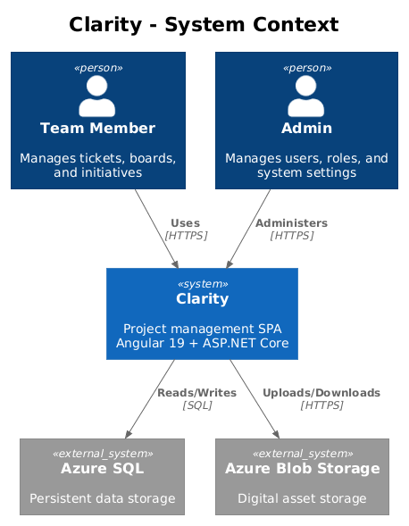
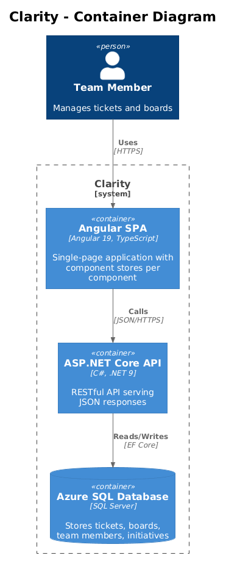
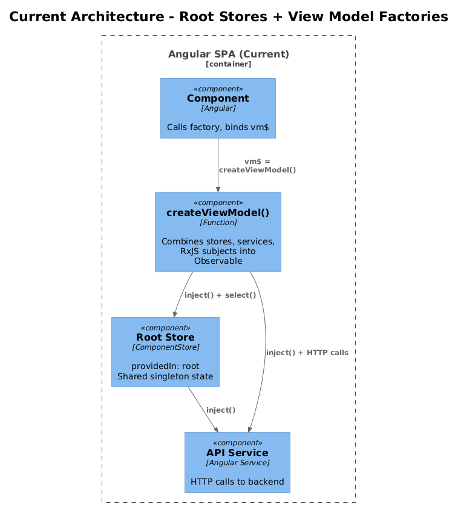
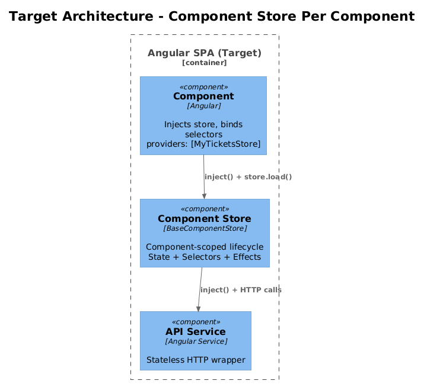
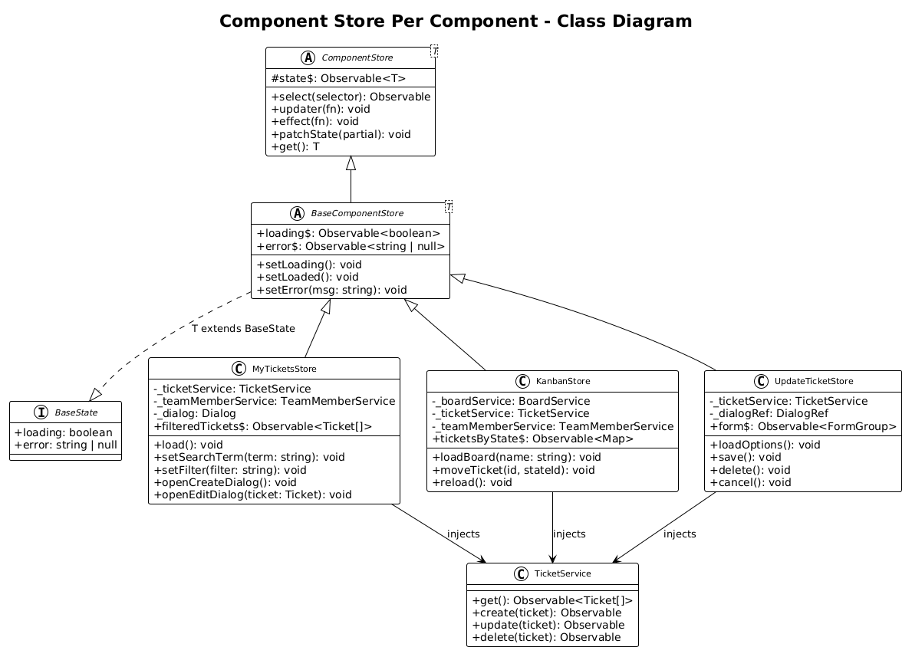
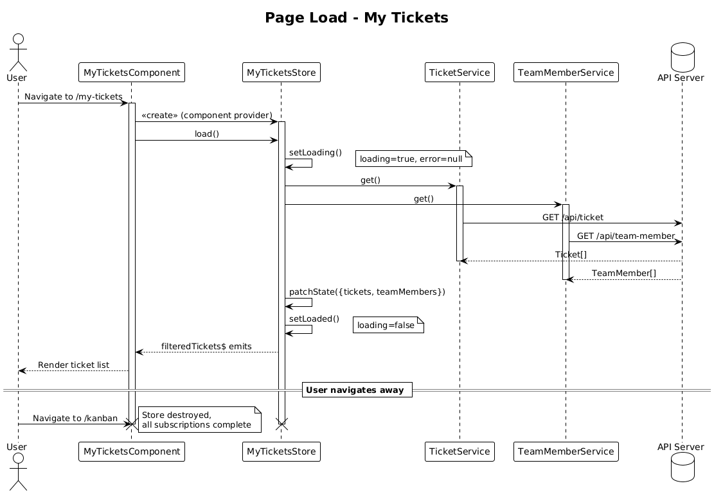
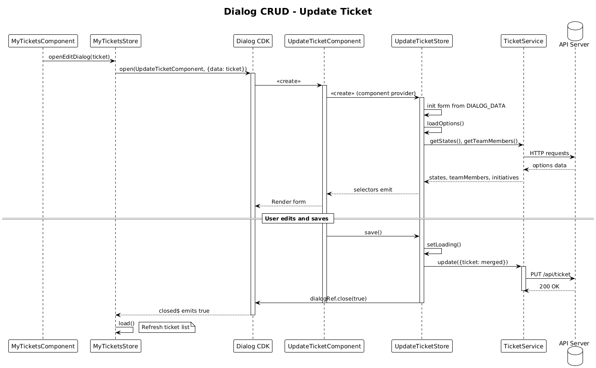
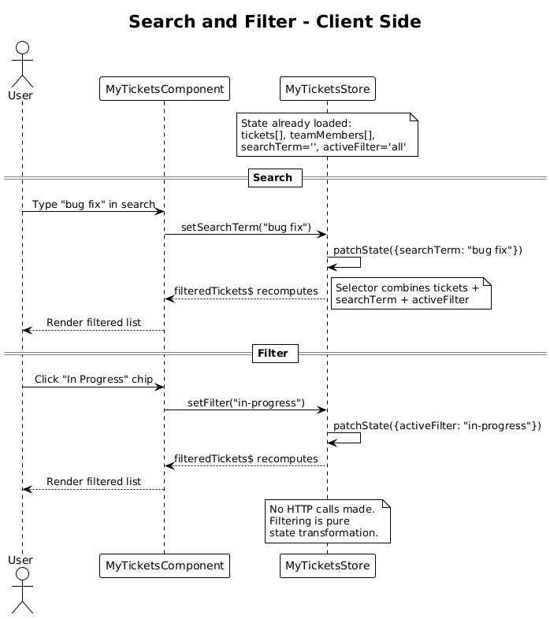

# Component Store Per Component — Detailed Design

## 1. Overview

This design replaces the current **"create view model factory"** pattern with a **"component store per component"** pattern. Today, each component delegates its state and logic to a standalone factory function (`createXViewModel()`) that returns an `Observable<ViewModel>`. These factories combine root-level singleton `ComponentStore` instances, services, RxJS subjects, and inline business logic into a single observable stream. While functional, this pattern has several problems:

- **No lifecycle management** — factory functions create RxJS subjects and subscriptions without cleanup, causing memory leaks (identified in the [frontend audit](../../frontend-audit.md))
- **No loading/error states** — components have no way to show loading spinners or error messages because stores only track entity arrays
- **Shared mutable state** — all 10 stores are `providedIn: 'root'` singletons, meaning unrelated components share and mutate the same state
- **Untestable** — factory functions use `inject()` at the top level, making them hard to unit test in isolation
- **Duplicated patterns** — every factory repeats the same combineLatest + map + Subject pattern with minor variations

### Actors

- **Angular Components** — consume their dedicated component store via dependency injection
- **Component Stores** — manage component-scoped state, effects, selectors, and UI logic
- **API Services** — existing HTTP services (`TicketService`, `BoardService`, etc.) remain unchanged

### Scope Boundary

This design covers the `projects/components` library. The `projects/api` library and backend are not modified. The `projects/clarity-admin` app (which uses services directly) is out of scope but can adopt the pattern later.

## 2. Architecture

### 2.1 C4 Context Diagram

How the Clarity frontend fits in the broader system.



### 2.2 C4 Container Diagram

The technical building blocks involved in the migration.



### 2.3 C4 Component Diagram — Before (Current State)

The current architecture with root-level stores and view model factories.



### 2.4 C4 Component Diagram — After (Target State)

The target architecture with component-scoped stores.



## 3. Component Details

### 3.1 Component Store Base Class

**Responsibility:** Provides shared state shape (loading, error), common updaters, and a standardized effect helper that manages loading/error transitions automatically.

**Location:** `projects/components/src/lib/base/base-component.store.ts`

**Interface:**

```typescript
export interface BaseState {
  loading: boolean;
  error: string | null;
}

export abstract class BaseComponentStore<T extends BaseState> extends ComponentStore<T> {
  // Selectors
  readonly loading$ = this.select(s => s.loading);
  readonly error$ = this.select(s => s.error);

  // Updaters
  readonly setLoading = this.updater((state) => ({ ...state, loading: true, error: null }));
  readonly setLoaded = this.updater((state) => ({ ...state, loading: false }));
  readonly setError = this.updater((state, error: string) => ({ ...state, loading: false, error }));
}
```

**Design decision:** A base class rather than a mixin because every component store needs loading/error state, and inheritance from `ComponentStore` is already required. This avoids repeating the same three selectors and updaters in every store.

### 3.2 Feature Component Store (Example: MyTicketsStore)

**Responsibility:** Manages all state and logic for the `MyTicketsComponent` — replaces both the root-level `TicketStore` usage and the `createMyTicketsViewModel()` factory.

**Location:** `projects/components/src/lib/components/my-tickets/my-tickets.store.ts`

**Provided at:** Component level via `providers: [MyTicketsStore]` — destroyed when the component is destroyed, eliminating memory leaks.

**State interface:**

```typescript
interface MyTicketsState extends BaseState {
  tickets: Ticket[];
  teamMembers: TeamMember[];
  searchTerm: string;
  activeFilter: string;
}
```

**Selectors:**

```typescript
readonly filteredTickets$ = this.select(
  this.select(s => s.tickets),
  this.select(s => s.searchTerm),
  this.select(s => s.activeFilter),
  (tickets, searchTerm, activeFilter) => { /* filter logic */ }
);
```

**Updaters:**

```typescript
readonly setSearchTerm = this.updater((state, term: string) => ({ ...state, searchTerm: term }));
readonly setFilter = this.updater((state, filter: string) => ({ ...state, activeFilter: filter }));
```

**Effects:**

```typescript
readonly load = this.effect<void>(trigger$ =>
  trigger$.pipe(
    tap(() => this.setLoading()),
    switchMap(() => forkJoin([
      this._ticketService.get(),
      this._teamMemberService.get()
    ]).pipe(
      tapResponse(
        ([tickets, teamMembers]) => {
          this.patchState({ tickets, teamMembers });
          this.setLoaded();
        },
        (error) => this.setError(extractMessage(error))
      )
    ))
  )
);
```

**Dependencies:** `TicketService`, `TeamMemberService`, `Dialog` (all injected via `inject()`)

### 3.3 Dialog Component Store (Example: UpdateTicketStore)

**Responsibility:** Manages form state and save/delete logic for the update ticket dialog.

**Location:** `projects/components/src/lib/components/update-ticket/update-ticket.store.ts`

**Key difference from page stores:** Dialog stores receive initial data via constructor injection (`DIALOG_DATA`) and close the dialog as a side effect of save/cancel operations.

**State interface:**

```typescript
interface UpdateTicketState extends BaseState {
  ticket: Ticket;
  form: UntypedFormGroup;
  states: BoardState[];
  teamMembers: TeamMember[];
  initiatives: Initiative[];
}
```

**Effects:**

```typescript
readonly save = this.effect<void>(trigger$ =>
  trigger$.pipe(
    tap(() => this.setLoading()),
    withLatestFrom(this.select(s => s.form), this.select(s => s.ticket)),
    switchMap(([_, form, ticket]) =>
      this._ticketService.update({ ticket: { ...ticket, ...form.value } }).pipe(
        tapResponse(
          () => this._dialogRef.close(true),
          (error) => this.setError(extractMessage(error))
        )
      )
    )
  )
);
```

### 3.4 Existing Root-Level Stores — Disposition

The 10 existing root-level stores (`TicketStore`, `BoardStore`, etc.) are **removed entirely**. Their responsibilities are absorbed into component-scoped stores:

| Current Root Store | Replaced By |
|---|---|
| `TicketStore` | `MyTicketsStore`, `KanbanStore`, `TicketEditorStore`, etc. |
| `BoardStore` | `BoardListStore`, `KanbanStore`, `SelectBoardStore`, etc. |
| `InitiativeStore` | `InitiativesStore`, `InitiativeReportStore` |
| `TeamMemberStore` | `TeamStore`, `CurrentTeamMemberStore` |
| `CommentStore` | `CommentEditorStore`, `CreateCommentStore` |
| `DigitalAssetStore` | `FileManagementStore`, `FileEditorStore` |
| `UserStore` | `LoginStore`, `ProfileStore` |
| `BoardStateStore` | `KanbanBoardColumnsStore`, `DeleteBoardStateStore` |
| `StateStore` | Absorbed into stores that need lookup data |
| `TicketStateStore` | Absorbed into relevant ticket component stores |

**Trade-off:** This means two components displaying tickets (e.g., `MyTickets` and `Kanban`) each fetch their own data independently rather than sharing a cache. This is intentional — it eliminates shared mutable state bugs and stale data. If cross-component data sharing becomes a requirement later, a lightweight read-through cache service can be introduced without changing the component store pattern.

### 3.5 Component Consumption Pattern

**Before (current):**

```typescript
@Component({ ... })
export class MyTicketsComponent {
  public vm$ = createMyTicketsViewModel();
}
```

**After (target):**

```typescript
@Component({
  providers: [MyTicketsStore],
  ...
})
export class MyTicketsComponent {
  readonly store = inject(MyTicketsStore);

  constructor() {
    this.store.load();
  }
}
```

Templates change from `*ngIf="vm$ | ngrxPush as vm"` wrapping to direct selector subscriptions:

```html
<div class="loading" *ngIf="store.loading$ | ngrxPush">Loading...</div>
<div class="error" *ngIf="store.error$ | ngrxPush as error">{{ error }}</div>
<table *ngIf="store.filteredTickets$ | ngrxPush as tickets">
  ...
</table>
```

## 4. Data Model

### 4.1 Class Diagram



### 4.2 Entity Descriptions

**BaseState** — Abstract state interface shared by all component stores. Contains `loading: boolean` and `error: string | null`.

**BaseComponentStore\<T extends BaseState\>** — Abstract base class extending `ComponentStore<T>`. Provides `loading$`, `error$` selectors and `setLoading`, `setLoaded`, `setError` updaters.

**MyTicketsStore** — Concrete store for the My Tickets page. State includes `tickets`, `teamMembers`, `searchTerm`, and `activeFilter`. Effects: `load`, `openCreateDialog`, `openEditDialog`. Selectors: `filteredTickets$`.

**KanbanStore** — Concrete store for the Kanban board page. State includes `board`, `tickets`, `teamMembers`, `boardStates`. Effects: `loadBoard`, `moveTicket`, `reload`. Selectors: `ticketsByState$`.

**UpdateTicketStore** — Concrete store for the update ticket dialog. State includes `ticket`, `form`, `states`, `teamMembers`, `initiatives`. Effects: `loadOptions`, `save`, `delete`.

**API Services** (unchanged) — `TicketService`, `BoardService`, `TeamMemberService`, etc. These remain stateless HTTP wrappers and are injected into component stores.

## 5. Key Workflows

### 5.1 Page Load — My Tickets

The component is created, its store is instantiated (scoped to the component), data is fetched, and the template renders reactively.



**Steps:**
1. Angular instantiates `MyTicketsComponent` and its provider `MyTicketsStore`
2. Component constructor calls `store.load()`
3. Store sets `loading: true` and fires parallel HTTP requests via `TicketService.get()` and `TeamMemberService.get()`
4. On success, store patches state with tickets and team members, sets `loading: false`
5. Template selectors (`filteredTickets$`, `loading$`) emit new values, triggering change detection via `PushPipe`
6. When the user navigates away, Angular destroys the component and the store, completing all subscriptions

### 5.2 Dialog CRUD — Update Ticket

A parent component opens a dialog, the dialog's store manages form state, and the parent reloads on close.



**Steps:**
1. Parent component (e.g., `MyTicketsComponent`) calls `store.openEditDialog(ticket)`
2. Store opens `UpdateTicketComponent` dialog with `DIALOG_DATA`
3. `UpdateTicketStore` is instantiated at dialog component level, receives ticket data
4. Store fires `loadOptions` effect to fetch states, team members, initiatives
5. User edits the form and clicks Save
6. Store fires `save` effect — calls `TicketService.update()`
7. On success, store closes the dialog via `DialogRef.close(true)`
8. Parent store's dialog subscription receives the close event and calls `this.load()` to refresh

### 5.3 Search and Filter — Client-Side

User types in a search box or clicks a filter chip, and the list updates without an API call.



**Steps:**
1. User types in the search input, which emits to the component
2. Component calls `store.setSearchTerm(term)` (an updater, not an effect)
3. Store patches state: `{ searchTerm: term }`
4. The `filteredTickets$` selector recomputes — it combines `tickets`, `searchTerm`, and `activeFilter`
5. Template re-renders with the filtered list
6. No HTTP calls are made — filtering is purely client-side on already-loaded data

## 6. API Contracts

No API changes are required. The existing `@api` library services (`TicketService`, `BoardService`, etc.) are consumed identically — only the caller changes from view model factories to component stores.

## 7. Migration Strategy

### 7.1 Migration Order

Migrate components in this order to minimize risk and validate the pattern early:

**Phase 1 — Establish the pattern (1 page + 1 dialog):**
1. `BaseComponentStore` base class
2. `MyTicketsComponent` + `MyTicketsStore` (representative page component)
3. `UpdateTicketComponent` + `UpdateTicketStore` (representative dialog component)

**Phase 2 — Migrate remaining ticket components:**
4. `CreateTicketComponent`, `UpsertTicketComponent`, `TicketComponent`, `TicketEditorComponent`, `SearchResultsComponent`

**Phase 3 — Migrate board/kanban components:**
5. `KanbanComponent`, `KanbanBoardComponent`, `KanbanBoardColumnsComponent`, `KanbanBoardControlsComponent`
6. `BoardListComponent`, `CreateBoardComponent`, `CloneBoardComponent`, `DeleteBoardComponent`, `SelectBoardComponent`, `DeleteBoardStateComponent`

**Phase 4 — Migrate remaining entity components:**
7. `InitiativesComponent`, `InitiativeReportComponent`, `CreateInitiativeComponent`, `UpdateInitiativeComponent`
8. `TeamComponent`, `CreateTeamMemberComponent`, `UpdateTeamMemberComponent`, `CurrentTeamMemberComponent`
9. `FileManagementComponent`, `FileEditorComponent`
10. `CommentEditorComponent`, `CreateCommentComponent`
11. `LoginComponent` (uses `UserStore`), `ProfileComponent`

**Phase 5 — Cleanup:**
12. Delete all `create-*-view-model.ts` files and their specs
13. Delete root-level stores from `projects/components/src/lib/stores/`
14. Remove `stores/index.ts` barrel export
15. Update `projects/components/src/lib/components/index.ts` exports

### 7.2 Per-Component Migration Checklist

For each component:

1. Create `{component-name}.store.ts` in the component's folder
2. Define state interface extending `BaseState`
3. Move all logic from `create-{component-name}-view-model.ts` into the store as selectors, updaters, and effects
4. Update the component class: add `providers: [Store]`, inject the store, remove `vm$`
5. Update the template: replace `*ngIf="vm$ | ngrxPush as vm"` with individual selector subscriptions
6. Write unit tests for the new store
7. Delete the `create-{component-name}-view-model.ts` file and its spec
8. Verify the component works end-to-end

### 7.3 Coexistence During Migration

During the migration, both patterns will coexist. This is safe because:
- New component stores inject API services directly (not the old root stores)
- Unmigrated components continue using their view model factories and root stores
- No shared state between old and new patterns
- Root stores can be deleted only after all their consumers are migrated

## 8. Security Considerations

No new security concerns. The migration is purely a frontend architectural refactoring. Authentication, authorization, and API security remain unchanged.

## 9. Open Questions

1. **Should component stores use `switchMap` or `exhaustMap` for load effects?** The current root stores use `exhaustMap` (ignore new requests while one is in flight). For page loads, `switchMap` (cancel previous, use latest) may be more appropriate — e.g., when route params change rapidly. **Recommendation:** Use `switchMap` for load effects, `exhaustMap` for save/delete effects.

2. **Should filter state (search terms, active filters) survive navigation?** Currently it does not (factory creates fresh subjects each time). With component stores scoped to the component, it still will not. If the user wants filter persistence, a separate `FilterPersistenceService` could serialize filter state to query params. **Recommendation:** Do not add this now — keep parity with current behavior.

3. **Should the `Destroyable` base class be removed?** It provides `_destroyed$` subject for `takeUntil` patterns. With component-scoped stores (which auto-complete on destroy), and `takeUntilDestroyed()` from `@angular/core/rxjs-interop`, this base class may be unnecessary. **Recommendation:** Remove after migration is complete and all usages are verified eliminated.
